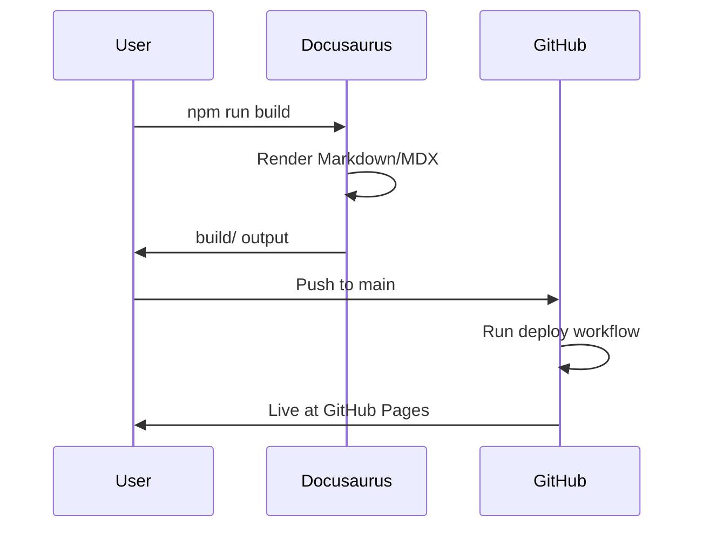
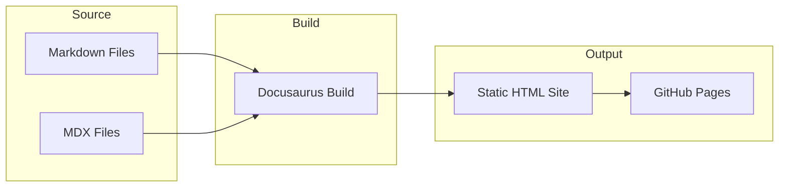
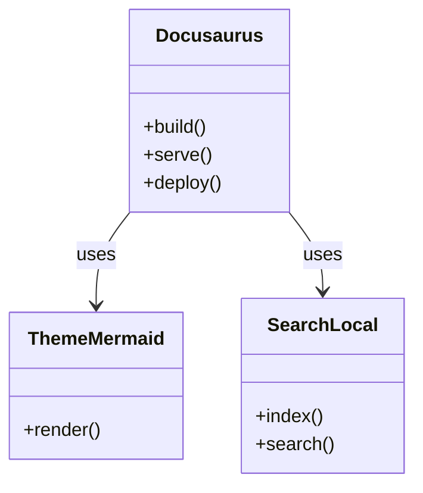

import Tabs from '@theme/Tabs';
import TabItem from '@theme/TabItem';

# Code Examples

This page demonstrates **code snippets** with:

- Syntax highlighting
- Optional **line numbers**
- Copy‑to‑clipboard button
- Multiple programming languages

All snippets below use standard fenced code blocks in Markdown/MDX.

## Java example

```java showLineNumbers
public class HelloWorld {
    public static void main(String[] args) {
        System.out.println("Hello, Docusaurus!");
    }
}
```

## YAML example

```yaml showLineNumbers
site:
  name: docusaurus-poc
  docs:
    - intro
    - getting-started
    - code-examples
    - accessibility
```

## Bash example

```bash showLineNumbers
npm install
npm run start

# Build the static site
npm run build

# Export docs to PDF (after build)
npm run export:pdf
```

## JSON example

```json showLineNumbers
{
  "name": "docusaurus-poc",
  "version": "0.0.0",
  "scripts": {
    "start": "docusaurus start",
    "build": "docusaurus build"
  }
}
```

## Language tabs

Use **tabs** to present equivalent snippets in multiple languages while saving
vertical space.

<Tabs>
  <TabItem value="bash" label="Bash">

```bash
npm install
npm run start
```

  </TabItem>
  <TabItem value="yaml" label="YAML">

```yaml
scripts:
  start: docusaurus start
  build: docusaurus build
```

  </TabItem>
  <TabItem value="json" label="JSON">

```json
{
  "scripts": {
    "start": "docusaurus start",
    "build": "docusaurus build"
  }
}
```

  </TabItem>
</Tabs>

All code blocks automatically include a **copy button** in the UI, and the
`showLineNumbers` meta flag enables optional line numbering.

## Mermaid diagrams

Docusaurus can render [Mermaid](https://mermaid.js.org/) diagrams from fenced code blocks when `@docusaurus/theme-mermaid` is enabled.

### Sequence diagram

Build and deploy flow:



### Flowchart

Doc build pipeline:



### Class diagram



